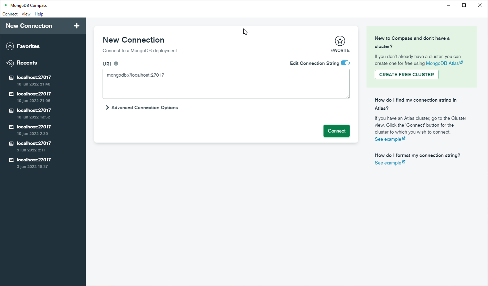
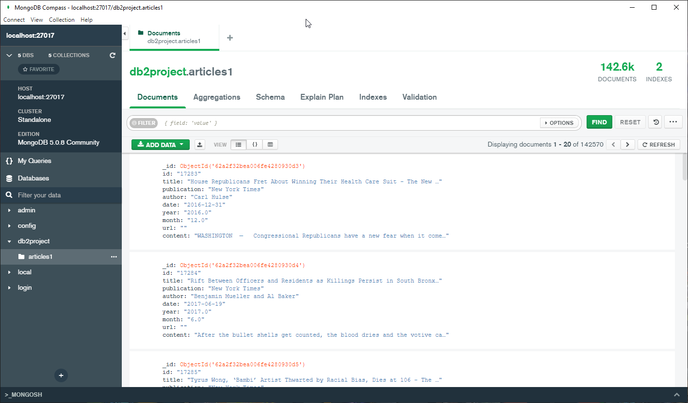
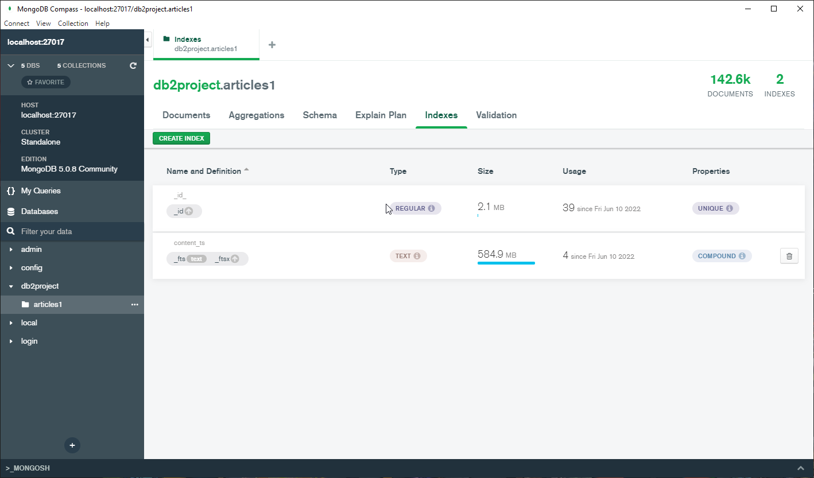

# Proyecto N°2 - Base de datos II

## Integrantes

- Alfaro, Gonzalo
- Arróspide, Eduardo
- Domínguez, Pedro
- Rodríguez, Renato

| Lista de actividades Realizadas | Responsable                         | Participación |
|---------------------------------|-------------------------------------|------|
| Algoritmo SPIMI, búsqueda por similitud de coseno | Pedro Domínguez, Gonzalo Alfaro|  100%  |
| Frontend, Conexión a PostgreSQL                   | Renato Rodríguez               |  100%  |
| Conexión a MongoDB                                | Eduardo Arróspide              |  100%  |


## Introducción

El objetivo del proyecto es el aprendizaje de algoritmos y estructuras que permitan realizar consultas de búsqueda eficientes a un conjunto de documentos utilizando el método de *ranked retrieval*. 

Este proyecto utiliza el **algoritmo SPIMI** para la optimización de indexación, así como la **búsqueda por similitud de coseno** para realizar las consultas.


## Datos

Los datos utilizados son un conjunto de noticias obtenidas de la página [Kaggle](https://www.kaggle.com/datasets/snapcrack/all-the-news). El buscador del proyecto retornará el título y ranking de cada noticia, y a su vez utilizará su contenido para crear el índice invertido.

## Construcción del índice invertido

Para la construccón del índice está compuesta por dos etapas principalmente.

1. **Pre-Processing:**
  El contenido de cada noticia debe ser pre-procesado, ignorando "stop words", realizar el stemming y normalizando el texto en general. Específicamente, nuestra aplicación realiza un proceso como el descrito a continuación:
    - Lowercase: todas las palabras a letras minúsculas
    - Stop words: remover todos los stop words. Utilizamos los stop words de inglés de la librería [NLTK](https://www.nltk.org/)
    - Puntuación: Remover todo símbolo de puntuación, puesto que no son necesarios para la creación del índice invertido.
    - Apostrofes: Remove apostrofes (muy usados en inglés) ya que, al igual que la puntuación, no son relevantes.
    - Stemming: Convertir todas las palabras a su raíz. Para esta acción utilizamos el [Porter Stemmer](https://www.nltk.org/howto/stem.html) de NLTK.
    - Num2Words: Utilizamos la librería [num2words](https://pypi.org/project/num2words/) para convertir cada número a su contraparte como palabra en inglés. Ej: 15 a "fifteen".
2. **Cálculo del TF:** 
  Para el cálculo de la frecuencia de términos utilizamos la libreria NLTK, ya que nos proporciona la funcionabilidad de manera directa utilizando "word_tokenize". Para la construcción de este índice buscamos un archivo de texto dentro de la carpeta de indices "indexes", si no es encontrada se crea un nuevo documento y se agrega el título de la noticia (que se está tomando como "documento" de forma teorica) junto a su TF.

## Ejecución óptima de consultas


## PostgreSQL / MongoDB
Para ambos se utiliza el archivo utils.py, que contiene dos funciones: remove_punctuation y query_tokens, que ayudarán a formatear la query, filtrando stopwords, eliminando caracteres no deseados y tokenizando las palabras. 

### PostgreSQL


### MongoDB
Para poder seguir comparando resultados, también se implementó la solución utilizando una base de datos NoSQL con MongoDB. MongoDB es un sistema de base de datos orientado a documentos que utiliza la estructura de datos **BSON**, similar a JSON. Para este proyecto, se descargó [MongoDB Community](https://www.mongodb.com/try/download/community), y se instaló junto a MongoDB Compass, una aplicación para visualizar de forma amigable las bases de datos y colecciones que se tienen en el local. El código está escrito considerando que, a través de MongoDB Compass, se establece una conexión localhost en el puerto 27017 (el predeterminado), se crea una base de datos llamada db2project y se crea la colección articles1. 




Se utilizó la librería pymongo para utilizar MongoDB desde Python, y se instaló con 
```
pip install pymongo
```
Para poblar la base de datos se utiliza csv.DictReader() y se va agregando la data, fila por fila, en diccionarios.

Si se quiere hacer full text search en MongoDB se tiene que crear, manualmente, un index en los campos que se quieran cubrir. Para este proyecto, se creó un índice llamado "content_ts" que cubre los campos "title" y "content". Para ello, se utilizó la siguiente línea de código: 
```
db.articles1.create_index([('title', 'text'), ('content', 'text')], name="content_ts")
```


Conforme se vayan corriendo los archivos en Python, se pueden ver los resultados en MongoDB Compass (dándole refresh). Una vez creado el índice, se utiliza el método .find() para la búsqueda, cuyos parámetros serán dos diccionarios. El primero es el que se necesita para hacer el text search, pero si se hace solo así los resultados no estarán ordenados por relevancia. Para ello, se debe agregar el segundo diccionario, "score" y luego hacer un sort con el mismo "score" de parámetro. 

```{python}
search = db.articles1.find(
    { "$text": { "$search": format_text } },
    { "score": { "$meta": "textScore" } }).limit(k)

search.sort([( "score", { "$meta": "textScore" } )])
```

## Video
