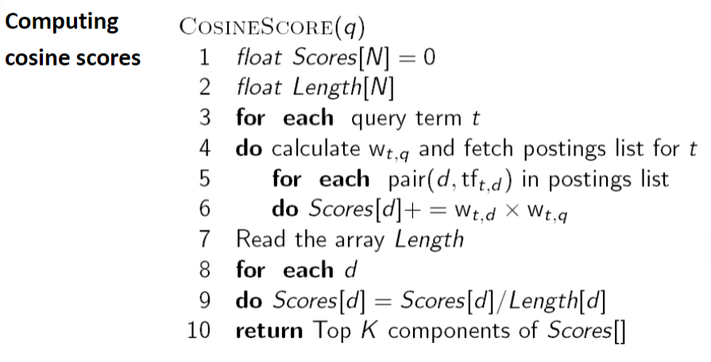

# Proyecto N°2 - Base de datos II

## Integrantes

- Alfaro, Gonzalo
- Arróspide, Eduardo
- Domínguez, Pedro
- Rodríguez, Renato

| Lista de actividades Realizadas | Responsable                         | Participación |
|---------------------------------|-------------------------------------|------|
| Algoritmo SPIMI, búsqueda por similitud de coseno | Pedro Domínguez, Gonzalo Alfaro|  100%  |
| Frontend, Conexión a PostgreSQL                   | Renato Rodríguez               |  100%  |
| Conexión a MongoDB                                | Eduardo Arróspide              |  100%  |

## Introducción

El objetivo del proyecto es el aprendizaje de algoritmos y estructuras que permitan realizar consultas de búsqueda eficientes a un conjunto de documentos utilizando el método de *ranked retrieval*. 

Este proyecto utiliza el **algoritmo SPIMI** para la optimización de indexación en memoria secundaria, así como la **búsqueda por similitud de coseno** para realizar las consultas.

## Datos

Los datos utilizados son un conjunto de noticias obtenidas de la página [Kaggle](https://www.kaggle.com/datasets/snapcrack/all-the-news). El buscador del proyecto retornará el título y ranking de cada noticia, y a su vez utilizará su contenido para crear el índice invertido.

## Construcción del índice invertido

## Ejecución óptima de consultas

La ejecución de la consulta sigue la siguiente secuencia de pasos:

1. Se le solicita al usuario un *query* y un número *k* arbitrario de respuestas que desea que se le muestre.
2. Al *query* se le formatea, tokeniza y se le calcula las frecuencias por cada término (*tf*)
3. Para obtener los pesos (*w*) de la query y de cada documento se utiliza el siguiente algoritmo: 
    
    - Acceder al par **(documento, tf)** y calcular los peso de cada término es sencillo gracias al índice invertido previamente construido
    -  Solo es necesario calcular la norma una sola vez al realizar una iteración a los vectores de pesos de cada documento.
4. Siguiendo el algoritmo se realiza las multiplicación de los pesos y su normalización.
5. Finalmente, se ordena el vector de *scoring* de manera descendente y se retorna los primeros *k* resultados solicitados por el cliente.

## PostgreSQL / MongoDB

## Video
